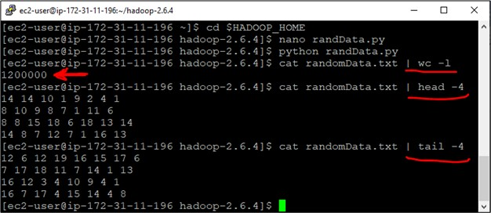

# Manual K-Means Clustering with Hadoop Streaming and Python

Welcome to the guide detailing the process of conducting multiple k-means clustering iterations on randomly generated data points using custom Python code and Hadoop Streaming!

## Initial set up:

- To initiate the k-means clustering task, I launched a 3-node [EC2](https://docs.aws.amazon.com/AWSEC2/latest/UserGuide/EC2_GetStarted.html) instance cluster. The setup comprised one t2.medium instance and two t2.small instances.
- The installation of 'hadoop-streaming-2.6.4' was performed to enable the streaming capability within Hadoop.
- Before executing the task, I ensured the proper commencement of the DFS (Distributed File System), YARN (Yet Another Resource Negotiator), and the job history server. [This](https://hadoop.apache.org/docs/stable/hadoop-project-dist/hadoop-common/ClusterSetup.html) primed the environment for seamless task execution.

## Custom Python files:

- **randData.py**: generates a 'randomData.txt' file comprising 1,200,000 8-dimensional data points which then will be divided into 12 distinct clusters using custom kmeans clustering code.
- **randCenters.py**: generates a centers.txt file by randomly selecting 12 of data points from the previous file, randomData.txt, as the initial cluster centers.
- **kmeansMapper.py**: is a core component of manual k-means clustering. It reads the center data from a file, creating a dictionary linking each of the 12 center IDs to its centroid values. Incoming data points are evaluated against these centroids. Euclidean distances are calculated between data points and the centroids, indicating similarity to cluster centers. The mapper identifies the closest cluster by minimal distance and generates output with cluster ID and point, separated by a tab, signifying data point assignment to a cluster.
- **kmeansReducer.py**: the reducer receives mapper's output as input lines that are pre-sorted based on the cluster ID (C1, C2, etc.), followed by the points belonging to each cluster. The main objective of the reducer is to group these points by their cluster ID and calculate new cluster centers and write it back to HDFS as a centers.txt file.

## Steps:

1. Start by copying the four specified Python files from this repository into the Hadoop directory of your EC2 instance.

2. Execute the 'randData.py' script to generate a 'randomData.txt' file. This text file will now encompass 1,200,000 lines, each representing a random data point. A snippet of the content is provided below, showcasing the first and last four lines of the file:

   

3. Running randCenters.py generates 12 initial centroids, randomly selected from the points in randomData.txt:

   

   This initial centers.txt file is the one we will be passing to the Hadoop streaming task in the first iteration.

4. Upload the data (randomData.txt) to HDFS using commands similar to the following:

   ```
   hadoop fs -mkdir myData
   hadoop fs -put randomData.txt /user/ec2-user/myData
   ```

5. Kmeans iteration 1: Execute the following Hadoop streaming command from your Hadoop home directory (Note, I was using hadoop 2.6.4 at the time. Make sure the hadoop-streaming jar file is copied to your hadoop home):

   ```
   hadoop jar hadoop-streaming-2.6.4.jar -input /user/ec2-user/myData -output /data/iteration1 -mapper kmeansMapper.py -reducer kmeansReducer.py -file kmeansMapper.py -file kmeansReducer.py -file centers.txt
   ```

6. After the first k-means iteration, you'll find updated centroids on HDFS (usually in a file named 'part-00000'). Remove the old 'centers.txt' and replace it with the new centroids data from iteration 1:

   ```
   rm centers.txt
   hadoop fs -get /data/iteration1/part-00000 centers.txt
   ```

7. Kmeans iteration 2: Execute the following command for the second round of k-means, using the updated centroids from iteration 1 as initial centroids:

   ```
   hadoop jar hadoop-streaming-2.6.4.jar -input /user/ec2-user/myData -output /data/iteration2 -mapper kmeansMapper.py -reducer kmeansReducer.py -file kmeansMapper.py -file kmeansReducer.py -file centers.txt
   ```

8. After the second iteration, obtain the new centroids data from 'part-00000' in the 'iteration2' folder on HDFS, and replace the old 'centers.txt':

   ```
   rm centers.txt
   hadoop fs -get /data/iteration2/part-00000 centers.txt

   ```

9. Iteration Repeats: Continue the process for several more iterations until centroids stabilize and show minimal change.

Happy coding!
